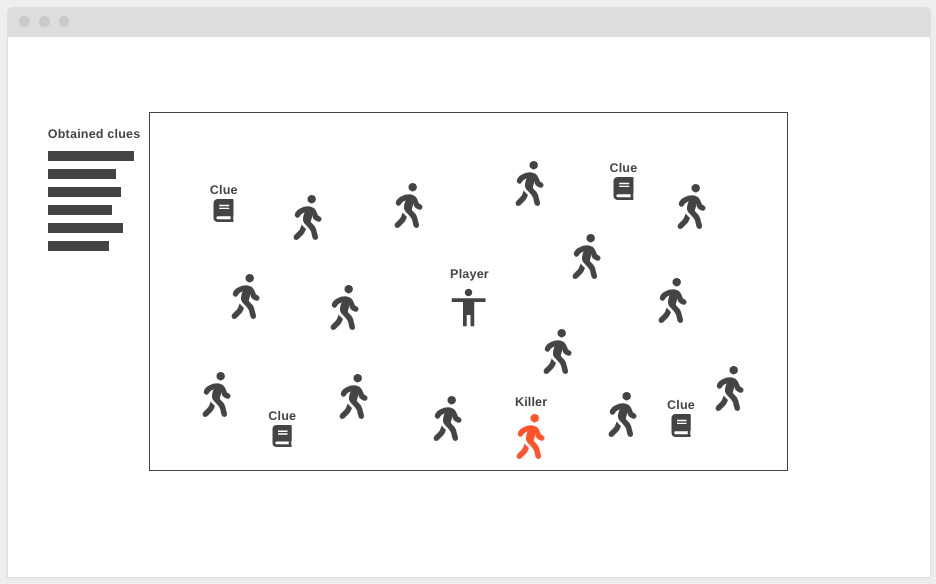

# Why So Sus?

Single-player javascript game influenced by Among Us

## Overview

You are a player surrounded by civilians. Feel free to wander around, but be careful. Why? There's a _killer_ on the loose and unless you want to be their next victim, find out who they are before they get you too! Look for _clues_ to make sure you're targeting the right person.

## Wireframe Concept

## MVP

* Create game space using canvas
* Render player and allow WASD input to move
* Render harmless civilians and one killer; all of which have randomized hat, shirt, pants, and shoe colors
* Implement condition where running into the killer will end in a loss
* Render clues holding color values of the killer
* Implement assassination function by clicking on a civilian
* End game loop on assassinating the killer
* Display win or loss on top of canvas

## Stretch Goals

* Let civilians (and killer) move randomly
* Supply more assassination options:
    * Easier: make list on the side with civilians left to choose from
    * Harder: make sure player is near a target before being allowed to take them down
    * Hardest (and more fun): shoot giant laser beam
* Civilian kill count by player and/or killer
* End game as loss if player accidentally kills an innocent
* Time limit to add difficulty
* Hide obtained clues after a certain time to add difficulty
* Blackout event: at random or certain intervals, black out the screen where civilians continue to move and the killer starts to kill civilians it walks into
* Add more space when walking up, to the right, down, or to the left of the starting room
* Accessibility mode: color blindness; make text with relevant colors layered on top of civilians (or on the list if implemented)